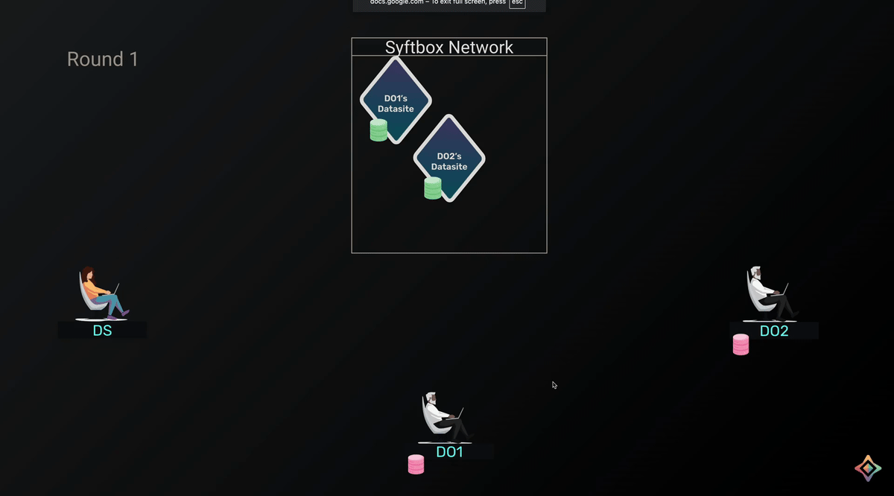

# syft_flwr

`syft_flwr` is an open source framework that facilitate federated learning projects using [Flower](https://github.com/adap/flower) over the [SyftBox](https://github.com/OpenMined/syftbox) protocol

## Example Usage
Please look at the [FL diabetes prediction](notebooks/fl-diabetes-prediction/README.md) workflow to see how `syft_flwr` can be used