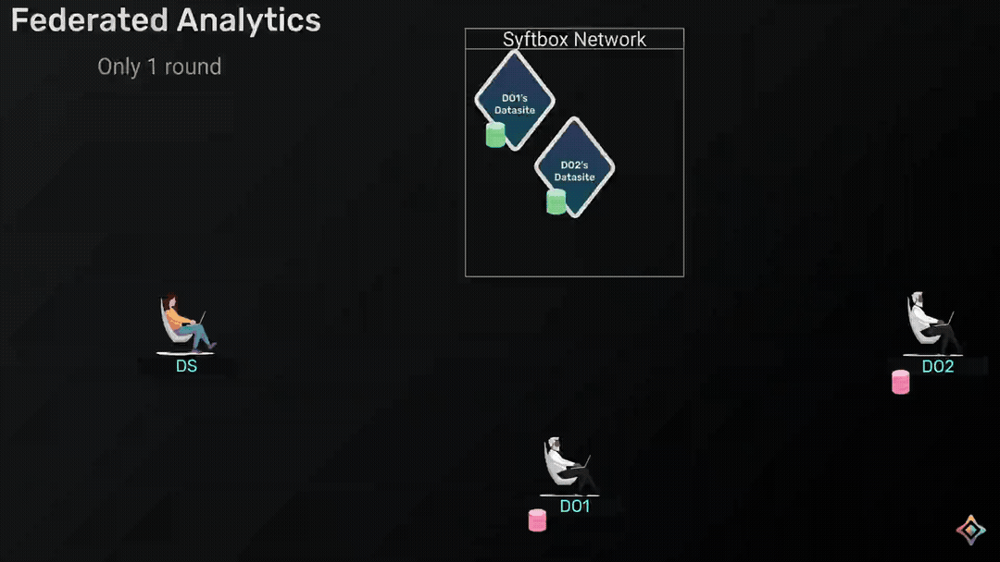

# Federated Analytics with `syft_flwr`

## Introduction

In this tutorial, we will walk through a practical implementation of a federated analyics workflow, e.g. finding mean and historgram of some private datasets and then aggregate them, using [syft_flwr](https://github.com/OpenMined/syft-flwr) — a framework that combines the flexibility of [Flower](https://github.com/adap/flower/) (a popular federated learning framework) with the privacy-preserving networking capabilities of [syftbox](https://www.syftbox.net/).



## Set up

### Clone the project
```bash
git clone https://github.com/OpenMined/syft-flwr.git _tmp \
		&& mv _tmp/notebooks/federated-analytics-diabetes . \
		&& rm -rf _tmp && cd federated-analytics-diabetes
```

### Setup python virtual environment
Assume that you have python and the [uv](https://docs.astral.sh/uv/) package manager installed. Now let's create a virtual python environment with `jupyter` installed:
```bash
uv sync
```

### Install and run `syftbox` client
Make sure you have syftbox client running in a terminal:
1. Install `syftbox`: `curl -fsSL https://syftbox.net/install.sh | sh`
2. Follow the instructions to start your `syftbox` client

When you have `syftbox` installed and run in the background, you can proceeed and run the notebooks with the installed Python environment in your favorite IDE.

## Workflow

### Local Setup
The set of notebooks in `local/` shows how things work with 2 data owners and 1 data scientists, whose datasites all stay in a local SyftBox network on your machine.

Please start with the `do1.ipynb`, then go to the `do2.ipynb`, and finally `ds.ipynb`, and switch hats when necessary when indicated to do so.

### Distributed setup
In the distributed setup in `distributed/`, we have the exact same workflow except that each DO's datasite and the DS's datasite run on different machines,and they communicate using the SyftBox client. There are detailed instructions to install the SyftBox client in the notebooks.

## References
- https://syftbox.net
- https://www.kaggle.com/datasets/uciml/pima-indians-diabetes-database/
- https://github.com/OpenMined/syftbox
- https://github.com/OpenMined/syft-flwr
- https://github.com/adap/flower/
- https://github.com/OpenMined/rds
