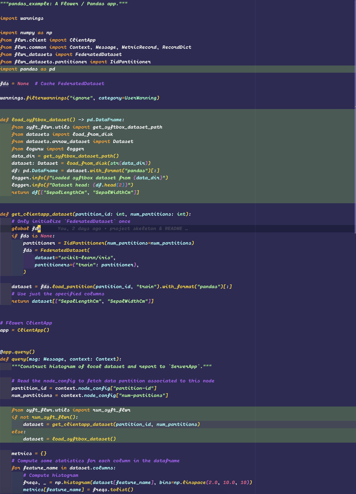

# Federated Analytics with `syft_flwr`

This example implements a form of Federated Analyics (no neural networks training) using `syft_flwr`, based on the [original example](https://github.com/adap/flower/blob/main/examples/quickstart-pandas/README.md) from Flower.
The clients (data owners) run a query to compute the histogram on specific columns of the dataset on the data they own. These metrics are sent to the server (data scientist) for aggregation.

## All what DS has to do
