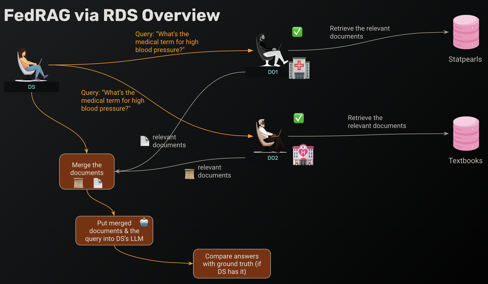

# Federated Retrieval Augmented Generation (FedRAG) for Privacy-Preserving Medical Question Answering
Medical knowledge is scattered across hospitals, research centers, and
healthcare systems worldwide, each guarding their data due to privacy regulations and
competitive concerns. Traditional AI systems require copying all this data to one
place, which is often impossible or illegal in healthcare. Federated RAG solves this
by letting AI systems search and learn from medical documents across multiple
institutions without moving or exposing the actual data. Each hospital keeps its
medical records and research private while still contributing to a shared AI that can
answer medical questions more accurately. This approach enables better medical AI
assistants that respect patient privacy and institutional boundaries—essential for
real-world healthcare deployment where data sharing faces strict legal and ethical
constraints.

## Overview


## Installing Dependencies
### `uv` - a fast Python package manager
- macOS/Linux:
```
curl -LsSf https://astral.sh/uv/install.sh | sh
```
- Windows (PowerShell):
```
powershell -ExecutionPolicy ByPass -c "irm https://astral.sh/uv/install.ps1 | iex"
```

Alternative methods:
  - With pip: `pip install uv`
  - With Homebrew (macOS): `brew install uv`


After installation, you can use uv sync to install your project dependencies from the `pyproject.toml` file
```bash
uv sync
```
this will create a virtual python environment at `.venv`.


### `wget` and `git-lfs` (for dataset downloading)
`wget` is used to download `.tar` files from the Web. `git-lfs` is used to download large files from the Hugging Face respository
- macOS
```
brew install wget
brew install git-lfs
```
- RHEL
```
yum install wget
yum install git-lfs
```
- Ubuntu/Debian
```
apt install wget
apt install git-lfs
```
- Windows: If you are on Windows, it is highly recommended to make use of WSL with Ubuntu to run your Flower apps. Then, you can install the packages using the above Ubuntu commands. Extra tip: with WSL you can also make use of the NVIDIA GPU in your Windows host.

- enable Git LFS in your Git environment (applicable for all systems)
```
git lfs install
```

## Download & Index Corpus

Run
```bash
./data/prepare.sh
```
to download the `Textbooks` and `StatPearls` corpora and create an index for each corpus using the *first 100 chunks (documents)*. The processed data will be downloaded under the `data/corpus` directory. The total required disk space for all the documents of `Textbooks` and `StatPearls` is around `3GBs`

#### StatPearls Processing Flow:

1. Download (`download.py:30-40`):
  - Downloads from NIH: `statpearls_NBK430685.tar.gz`
  - Extracts to `corpus/statpearls/statpearls_NBK430685/`
  - Contains XML files (`.nxml` format)
2. Chunking - Breaking large medical texts into bite-sized pieces (`statpearls.py`):
  - Parses each `.nxml` file (medical articles in XML format)
  - Extracts structure: Title → Sections → Paragraphs
  - Smart chunking logic:
      - Concatenates short paragraphs (<200 chars) if total <1000 chars
    - Preserves section hierarchy in titles: "Article -- Section -- Subsection"
    - Each chunk gets ID: `statpearls_NBK430685_0, _1, _2...`
  - Outputs: `corpus/statpearls/chunk/*.jsonl` (9,618 files)
3. Indexing (`retriever.py:build_faiss_index`):
  - Reads all JSONL files from `chunk/`
  - Generates embeddings using `SentenceTransformer`
  - Creates FAISS index (`faiss.index`) and `all_doc_ids.npy`

#### Textbooks Processing Flow:

1. Download (`download.py:22-28`):
  - Clones from HuggingFace: `MedRAG/textbooks`
  - Uses Git LFS for large files
  - Already pre-chunked into JSONL files
2. No chunking needed:
  - Textbooks arrive pre-processed as JSONL files
  - 18 textbooks, already split into chunks
  - Format: `corpus/textbooks/chunk/*.jsonl`
3. Indexing (same as StatPearls, using `retriever.py:build_faiss_index`):
  - Directly builds FAISS index from existing chunks

Final Structure:
```
├── corpus                               # Medical knowledge base for RAG
│   ├── statpearls                       # StatPearls medical database
│   │   ├── all_doc_ids.npy              # NumPy array mapping document IDs to articles
│   │   ├── chunk/                       # Contains 9,618 JSONL files with chunked medical articles
│   │   ├── faiss.index                  # FAISS vector index for fast similarity search
│   │   ├── statpearls_NBK430685         # Raw XML files
│   │   └── statpearls_NBK430685.tar.gz  # Compressed archive of raw data
│   │
│   └── textbooks                        # Medical textbook corpus
│       ├── all_doc_ids.npy              # Document ID mappings for textbook chunks
│       ├── chunk/                       # Chunked snippets (JSONL files) from 18 medical textbooks
│       ├── faiss.index                  # FAISS vector index for textbook content
│       └── README.md
```

To download all corpora and create an index for all files, please run the following command:
```bash
./data/prepare.sh --datasets "pubmed" "statpearls" "textbooks" "wikipedia" --index_num_chunks 0
```
The total disk space for the all documents of all four corpora is around `120GBs`.


### Splitting into mock and private

After running `CORPUS_NAME=<corpus_name> uv run data_processing/data_processing.py` (e.g. `CORPUS_NAME="statpearls" uv run data_processing/data_processing.py`), we will have the mock and private split for each corpus with rebuilt FAISS indices, with the following structure:
```
.
└── data_processing/
    ├── statpearls/
    │   ├── mock/
    │   │   ├── chunk/
    │   │   ├── all_doc_ids.npy
    │   │   └── faiss.index
    │   └── private/
    │       ├── chunk/
    │       ├── all_doc_ids.npy
    │       └── faiss.index
    └── textbooks/
        ├── mock/
        │   ├── chunk/
        │   ├── all_doc_ids.npy
        │   └── faiss.index
        └── private/
            ├── chunk/
            ├── all_doc_ids.npy
            └── faiss.index
```


### Dataset explanations

#### Clients' datasets
- **PubMed (23.9M docs):** Biomedical literature database from the National Library of Medicine. Contains abstracts and citations from life science journals and online books covering medicine, biology, and related fields.

- **StatPearls (9.3k docs):** Medical reference library providing peer-reviewed medical articles. Used by healthcare professionals and students for clinical knowledge, covering topics like diseases, procedures, and pharmacology.

- **Textbooks (18 docs):** Medical textbooks collection, likely comprehensive educational texts covering various medical specialties and foundational medical knowledge.

- **Wikipedia (6.5M docs)**: The general encyclopedia, providing broad coverage of medical and scientific topics in accessible language, useful for general medical information retrieval

In this federated setup, these corpora are distributed across clients for decentralized document retrieval, with each client indexing portions of the data locally.

#### Server's evaluation datasets
For QA benchmarking, the example supports the following benchmark datasets: `PubMedQA`, `BioASQ`, `MMLU`, `MedQA`, `MedMCQA`. These are question-answer pairs used to test how well the system performs. They contain pre-made questions with correct answers.

#### How they work together
1. Different clients hold different relevant documents from the corpora (`PubMed`, `StatPearls`, etc.)

2. The server uses those documents to answer questions from the QA benchmarks
3. The server compares generated answers against the benchmark's correct answers to measure performance

```
User Query → Server → [Client1, Client2, ...] → Local Retrieval
                  ↓
           Document Merging (RRF)
                  ↓
              LLM Inference
                  ↓
              Final Answer
```

```
client_app.py → retriever.py
server_app.py → {llm_querier.py, mirage_qa.py, task.py}
```


## References
- https://syftbox.net
- https://github.com/adap/flower/tree/main/examples/fedrag