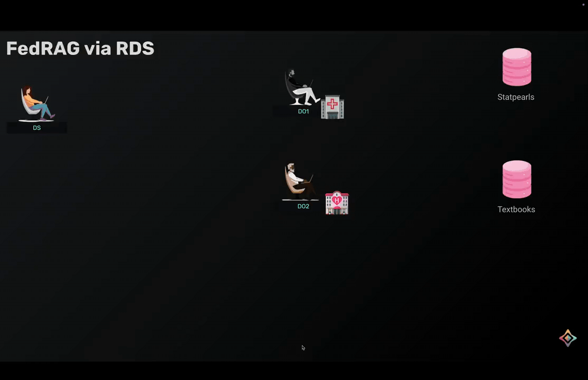

# Federated Retrieval Augmented Generation (FedRAG) via Remote Data Science for Privacy-Preserving Question Answering
Valuable knowledge is distributed across organizations worldwide, each protecting their data due to privacy regulations and competitive advantages. Traditional AI systems require centralizing all this data, which is often impossible or illegal. Federated RAG solves this by enabling AI systems to search and learn from documents across multiple organizations without moving or exposing the actual data. Crucially, with remote data science workflow, data owners maintain complete sovereignty—they review every computational job submitted to their systems and explicitly approve or reject requests based on their policies. This consent-based approach enables powerful AI assistants that respect data boundaries while allowing organizations to contribute to shared intelligence without compromising their proprietary information.




## Set up

### Clone the project
```bash
git clone https://github.com/OpenMined/syft-flwr.git _tmp \
		&& mv _tmp/notebooks/fedrag . \
		&& rm -rf _tmp && cd fedrag
```

### Setup python virtual environment
Assume that you have python and the [uv](https://docs.astral.sh/uv/) package manager installed. Now let's create a virtual python environment with `jupyter` installed:
```bash
uv sync
```

### Install and run `syftbox` client
Make sure you have syftbox client running in a terminal:
1. Install `syftbox`: `curl -fsSL https://syftbox.net/install.sh | sh`
2. Follow the instructions to start your `syftbox` client

When you have `syftbox` installed and run in the background, you can proceeed and run the notebooks with the installed Python environment in your favorite IDE.

## Workflow

### Local Setup
The set of notebooks in `local/` shows how things work with 2 data owners and 1 data scientists, whose datasites all stay in a local SyftBox network on your machine.

Please start with the `do1.ipynb`, then go to the `do2.ipynb`, and finally `ds.ipynb`, and switch hats when necessary when indicated to do so.

### Distributed setup (TODO)
In the distributed setup in `distributed/`, we have the exact same workflow except that each DO's datasite and the DS's datasite run on different machines, and they communicate using the SyftBox client. There are detailed instructions to install the SyftBox client in the notebooks.

## References
- https://syftbox.net
- https://github.com/OpenMined/syftbox
- https://github.com/OpenMined/syft-flwr
- https://github.com/adap/flower/
- https://flower.ai/docs/examples/fedrag.html