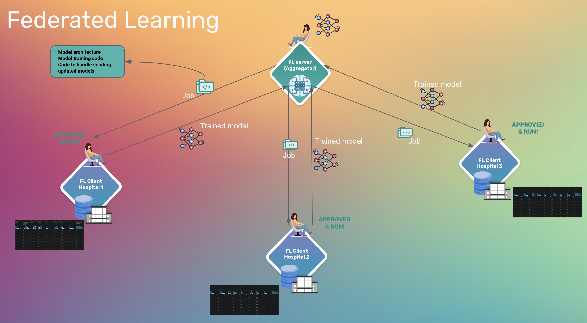

# Diabetes Prediction with `syft_flwr`

## Introduction

In this tutorial, we'll walk through a practical federated learning implementation for diabetes prediction using [syft_flwr](https://github.com/OpenMined/syft-flwr) — a framework that combines the flexibility of [Flower](https://github.com/adap/flower/) (a popular federated learning framework) with the privacy-preserving networking capabilities of [syftbox](https://www.syftbox.net/).



Dataset: https://www.kaggle.com/datasets/uciml/pima-indians-diabetes-database/

## Set up

### Clone the project
```bash
git clone https://github.com/OpenMined/syft-flwr.git _tmp \
		&& mv _tmp/notebooks/fl-diabetes-prediction . \
		&& rm -rf _tmp && cd fl-diabetes-prediction
```

### Setup python virtual environment
Assume that you have python and the [uv](https://docs.astral.sh/uv/) package manager installed. Now let's create a virtual python environment with `jupyter` installed:
```bash
uv venv
source .venv/bin/activate
uv pip install jupyterlab
```
Now you can run the notebooks with the installed environment in your favorite IDE.

### Install and run `syftbox` client
Make sure you have syftbox client running in a terminal:
1. Install `syftbox`: `curl -fsSL https://syftbox.net/install.sh | sh`
2. Follow the instructions to start your `syftbox` client

When you have `syftbox` installed and run in the background, you can proceeed and run the notebooks

## Workflow
1. For the data scientist's workflow (prepare code, observe mock datasets on the data owner's datasites, submit jobs), please look into the `ds.ipynb` notebook. Optionally, you can look at the `local_training.ipynb` to see the DS's process of processing data and training the neural network locally

2. For the data owner's workflow (uploading dataset, monitor and approve jobs), please take a look at `do.ipynb` notebook

## References
- https://syftbox.net
- https://www.kaggle.com/datasets/uciml/pima-indians-diabetes-database/
- https://github.com/OpenMined/syftbox
- https://github.com/OpenMined/syft-flwr
- https://github.com/adap/flower/
- https://github.com/OpenMined/rds
- https://github.com/elarsiad/diabetes-prediction-keras
