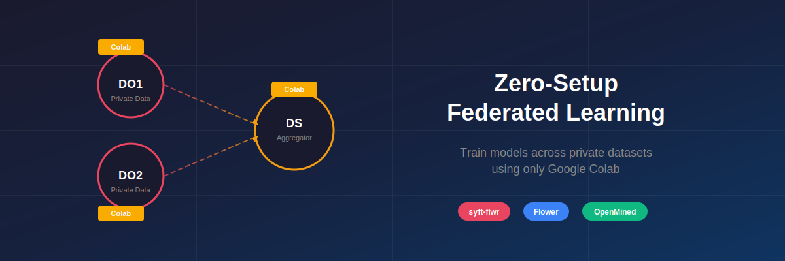

# Zero-Setup Federated Learning: Train Models Across Private Datasets Using Only Google Colab

Have you ever want to train a machine learning model on distributed private data without anyone sharing their raw data?
In this tutorial, you'll learn how to run a complete federated learning workflow directly from Google Colab—no local setup required.

We'll use the [PIMA Indians Diabetes dataset](https://www.kaggle.com/datasets/uciml/pima-indians-diabetes-database) split across two data owners to train a diabetes prediction model collaboratively, all while keeping each party's data private and secure.

**[Get the notebooks →](https://github.com/OpenMined/syft-flwr/tree/main/notebooks/fl-diabetes-prediction/distributed-gdrive)**

---

## Overview: The Parties

In this federated learning flow, there are three key parties:

1. **Data Owners (DO1 & DO2)**: Organizations that hold private data. Each runs their own Colab notebook to manage their data and approve training jobs.
2. **Data Scientist (DS)**: The coordinator who proposes the ML project, submits jobs to data owners, and aggregates the results.

Each party runs in a separate Google Colab notebook. You can use three different Google accounts (emails)—or call two friends to join you for a real collaborative experience!

The magic? Raw data never leaves the data owner's environment—only model updates are shared.

---

## Prerequisites

Before starting, you'll need:
- Three Google accounts (one for each party), or two friends willing to join
- Each person opens their respective notebook in Google Colab

That's it! No local Python installation, no complex setup.

---

## Step 1: Set Up the Data Owners

Each data owner runs their own notebook. Let's start with **DO1**.

### DO1 Notebook

1. Open a new Colab notebook
2. Install the syft-flwr package:

```python
!uv pip install -q "git+https://github.com/OpenMined/syft-flwr.git@main"
```

3. Login as a Data Owner:

```python
import syft_client as sc
import syft_flwr

print(f"{sc.__version__ = }")
print(f"{syft_flwr.__version__ = }")

do_email = input("Enter the Data Owner's email: ")
do_client = sc.login_do(email=do_email)
```

4. Download and register the dataset:

```python
from pathlib import Path
from huggingface_hub import snapshot_download

# Download the dataset from HuggingFace
DATASET_DIR = Path("./dataset/").expanduser().absolute()

if not DATASET_DIR.exists():
    snapshot_download(
        repo_id="khoaguin/pima-indians-diabetes-database-partitions",
        repo_type="dataset",
        local_dir=DATASET_DIR,
    )

# Create a Syft dataset with mock (public) and private paths
partition_number = 0  # DO1 uses partition 0
DATASET_PATH = DATASET_DIR / f"pima-indians-diabetes-database-{partition_number}"

do_client.create_dataset(
    name="pima-indians-diabetes-database",
    mock_path=DATASET_PATH / "mock",
    private_path=DATASET_PATH / "private",
    summary="PIMA Indians Diabetes dataset - Partition 0",
    readme_path=DATASET_PATH / "README.md",
    tags=["healthcare", "diabetes"],
    sync=True,
)

do_client.datasets.get_all()
```

**Key concept**: The `mock_path` contains synthetic/sample data that data scientists can explore and write code upon. The `private_path` contains the real data that never leaves this environment.

### DO2 Notebook

Repeat the same steps in a new Colab notebook, but change the partition number:

```python
partition_number = 1  # DO2 uses partition 1
```

Everything else stays the same. Now you have two data owners, each holding a different slice of the diabetes dataset.

---

## Step 2: Set Up the Data Scientist

In a third Colab notebook, set up the Data Scientist role.

### Login and Add Peers

```python
!uv pip install -q "git+https://github.com/OpenMined/syft-flwr.git@main"

import syft_client as sc
import syft_flwr

print(f"{sc.__version__ = }")
print(f"{syft_flwr.__version__ = }")

ds_email = input("Enter the Data Scientist's email: ")
ds_client = sc.login_ds(email=ds_email)
```

Add both data owners as peers:

```python
do1_email = input("Enter the First Data Owner's email: ")
ds_client.add_peer(do1_email)

do2_email = input("Enter the Second Data Owner's email: ")
ds_client.add_peer(do2_email)

# check that the 2 DOs are added as peers
ds_client.peers
```

### Explore Available Datasets

Before running any training, explore what data is available:

```python
# Check DO1's datasets
do1_datasets = ds_client.datasets.get_all(datasite=do1_email)
do1_datasets[0].describe()

# Check DO2's datasets
do2_datasets = ds_client.datasets.get_all(datasite=do2_email)
do2_datasets[0].describe()
```

Get the mock dataset URLs for local testing:

```python
mock_dataset_urls = [do1_datasets[0].mock_url, do2_datasets[0].mock_url]
mock_dataset_urls
```

---

## Step 3: Propose and Submit the FL Project

### Clone the FL Project

The FL project is built using [Flower](https://flower.ai/), a popular open-source federated learning framework. It defines the model architecture, training logic, and client/server communication—all following Flower's standard patterns. The `syft-flwr` integration handles the secure job submission, data governance and communication layer on top.

```python
from pathlib import Path

!mkdir -p /content/fl-diabetes-prediction
!curl -sL https://github.com/khoaguin/fl-diabetes-prediction/archive/refs/heads/main.tar.gz | tar -xz --strip-components=1 -C /content/fl-diabetes-prediction

SYFT_FLWR_PROJECT_PATH = Path("/content/fl-diabetes-prediction")
print(f"syft-flwr project at: {SYFT_FLWR_PROJECT_PATH}")
```

### Bootstrap the Project

This configures the project with the aggregator (DS) and participating datasites (DOs), and generates the `main.py` entry point:

```python
import syft_flwr

!rm -rf {SYFT_FLWR_PROJECT_PATH / "main.py"}

do_emails = [peer.email for peer in ds_client.peers]
syft_flwr.bootstrap(
    SYFT_FLWR_PROJECT_PATH,
    aggregator=ds_email,
    datasites=do_emails
)
print("Bootstrapped project successfully!")
```

### Submit Jobs to Data Owners

Now send the FL project to each data owner for review. The job contains the training code—data owners can inspect it before approving execution on their private data.

```python
!rm -rf {SYFT_FLWR_PROJECT_PATH / "fl_diabetes_prediction" / "__pycache__"}

job_name = "fl-diabetes-training"

# Submit to DO1
ds_client.submit_python_job(
    user=do1_email,
    code_path=str(SYFT_FLWR_PROJECT_PATH),
    job_name=job_name,
)

# Submit to DO2
ds_client.submit_python_job(
    user=do2_email,
    code_path=str(SYFT_FLWR_PROJECT_PATH),
    job_name=job_name,
)

ds_client.jobs
```

---

## Step 4: Data Owners Approve and Run Jobs

Back in each Data Owner's notebook, check for incoming jobs:

```python
do_client.jobs
```

Review and approve the job:

```python
do_client.jobs[0].approve()
do_client.jobs
```

Process the approved jobs (this runs the actual client-side training on private data for each DO):

```python
do_client.process_approved_jobs()
```

Check the job status:

```python
do_client.jobs
```

**Repeat this in both DO1 and DO2 notebooks.**

---

## Step 5: Run the Federated Training

Back in the Data Scientist notebook, install the required packages and run the aggregator-side logic of the federated training:

```python
!uv pip install \
    "flwr-datasets>=0.5.0" \
    "imblearn>=0.0" \
    "loguru>=0.7.3" \
    "pandas>=2.3.0" \
    "ipywidgets>=8.1.7" \
    "scikit-learn==1.7.1" \
    "torch>=2.8.0" \
    "ray==2.31.0"
```

Start the aggregation server:

```python
ds_email = ds_client.email
syftbox_folder = f"/content/SyftBox_{ds_email}"

!SYFTBOX_EMAIL="{ds_email}" SYFTBOX_FOLDER="{syftbox_folder}" \
    uv run {str(SYFT_FLWR_PROJECT_PATH / "main.py")}
```

Check the final job status:

```python
ds_client.jobs
```

---

## Step 6: Clean Up

When you're done, clean up the SyftBox resources in each notebook:

```python
# In DS notebook
ds_client.delete_syftbox()

# In DO1 and DO2 notebooks
do_client.delete_syftbox()
```

---

## What Just Happened?

You successfully trained a diabetes prediction model using federated learning:

1. **Two data owners** each held a private partition of the PIMA Indians Diabetes dataset
2. **A data scientist** coordinated the training without ever seeing the raw data
3. **Model updates** were aggregated using the Flower framework
4. **Privacy was preserved**—raw data never left the data owner's Colab environment

This is the core promise of federated learning: collaborative machine learning without sharing sensitive data.

---

## Next Steps

**Ready to build production federated learning solutions?**

We invite data scientists, researchers, and engineers working on production federated learning use cases to apply to our [Federated Learning Co-Design Program](https://openmined.org/co-design). You'll get direct support from the OpenMined team.

[Apply to the Co-Design Program Now](https://openmined.org/co-design)

**Have questions or want to contribute?**

Join the conversation in our [Slack Community](https://slack.openmined.org). Already in the OpenMined workspace? Join the **#community-federated-learning** channel.

---

## Resources

- [syft-flwr GitHub Repository](https://github.com/OpenMined/syft-flwr)
- [Flower Framework Documentation](https://flower.dev/docs/)
- [OpenMined Community](https://openmined.org)
