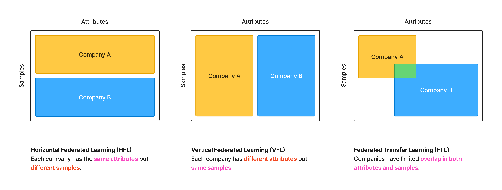
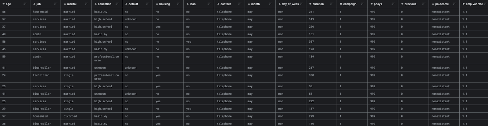
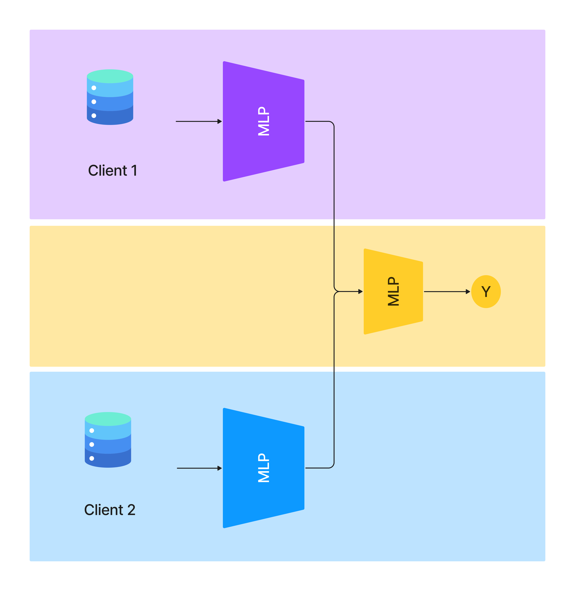

# Vertical Federated Learning Tutorial with `syft_flwr`

Federated Learning (FL) offers a new approach to distributed AI training, allowing multiple organizations to collaborate on AI model development while maintaining data privacy. However, standard Horizontal Federated Learning (HFL) requires all participating organizations to use the same features, which can restrict wider collaboration.

This tutorial introduces Vertical Federated Learning (VFL), a specialized FL approach that overcomes the feature constraint, enabling organizations to learn from each other without this limitation. We use `syft-flwr`, an open-source framework that facilitates federated learning projects using `flower` over the `SyftBox` protocol.

For our experiment, we utilize bank marketing campaign data from Portugal [2] dataset. This dataset details the outcomes of direct phone call campaigns aimed at encouraging bank clients to open term deposits. The target variable indicates 'yes' if the client agreed to place a deposit after the marketing efforts, and 'no' otherwise.



## Exploring the data



First, let’s explore our data “Bank Marketing Campaign”. This dataset contains 21 features designed to predict whether customers will subscribe to term deposits. The features are organized into three main categories: customer bank information, campaign details, and economic indicators.

### Attributes

#### Bank Customer Information

The following features capture demographic and financial characteristics of bank customers:

- Age (Numeric)
- Job (Categorical)
- Marital (Categorical)
- Education (Categorical)
- Default: Has credit in default? (Categorical)
- Housing: Has a housing loan? (Categorical)
- Loan: Has a personal loan? (Categorical)

#### Campaign Information

These features track the marketing campaign interactions and history:

- Contact: Communication type (Categorical)
- Month: Last contact month of the year (Categorical)
- Day of Week: Last contact day of the week (Categorical)
- Duration: Last contact duration in seconds (Numerical)
- Campaign: Number of contacts performed during this campaign and for this client (Numeric)
- Pdays: Number of days that passed by after the client was last contacted (Numeric)
- Previous: Number of contacts performed before this campaign (Numeric)
- Poutcome: Outcome of the previous marketing campaign (Categorical)

#### Target Variable

- Y: has the client subscribed to a term deposit? (binary: "yes","no")

### Data Preprocessing

```python
# one-hot encoding
def transform_data_oh(
    df: pd.DataFrame, 
    categorical_columns: List[str], 
    target_col: str
) -> Tuple[pd.DataFrame, pd.DataFrame]:
    X = df.drop(target_col, axis=1)
    y = df[target_col].map({"no": 0, "yes": 1})
    X = pd.get_dummies(X, columns=categorical_columns).astype(np.float32)
    return X, y

# label encoding
def transform_data_le(
    df: pd.DataFrame, 
    categorical_columns: List[str], 
    target_col: str
) -> Tuple[pd.DataFrame, pd.DataFrame]:
    X = df.drop(target_col, axis=1)
    y = df[target_col].map({"no": 0, "yes": 1})
    X[categorical_columns] = X[categorical_columns].apply(lambda x: x.astype("category").cat.codes)
    return X, y
```

For the categorical features, we implement two types of encoding strategy - one-hot encoding, label encoding.

You need to download the data from the following link: https://www.kaggle.com/datasets/volodymyrgavrysh/bank-marketing-campaigns-dataset and save it to `./data/bank-additional-full.csv`

To run the pipeline, please run the following command:

```bash
python scripts/prepare_data.py
```

## Vertical Federated Learning

Vertical Federated Learning (VFL) is a specialized FL approach designed to overcome the feature alignment constraint. VFL enables organizations with complementary datasets to collaborate without compromising data privacy, opening new possibilities for cross-industry partnerships and enhanced model performance.

Key Distinction: While HFL involves participants with the same features but different samples (horizontal data partitioning), VFL involves participants with different features about the same samples (vertical data partitioning).



In this experiment, we design the workflow illustrated in Figure 3. In this three-party VFL setup, the server is the party who faciliate the collaboration between client 1 and client 2.

### Data Partitioning Strategy For VFL
- client 1: bank data
- client 2: campaign data
- server: target variable

Since our pipeline running on `SyftBox`, to upload the data to `SyftBox`, we need to upload transformed using the notebooks `do_1.ipynb` and `do_2.ipynb`.

### Server

The server is the party who faciliate the collaboration between client 1 and client 2. The server is responsible for the following tasks:
- concatenate the embedding of client 1 and client 2
- feed the concatenated embedding to the model
- backpropagate the loss to the client 1 and client 2

```python
class AggregateCustomMetricStrategy(FedAvgWithModelSaving):
    def __init__(
        self,
        labels,
        save_path,
        *,
        fraction_fit=1,
        fraction_evaluate=1,
        min_fit_clients=2,
        min_evaluate_clients=2,
        min_available_clients=2,
        evaluate_fn=None,
        on_fit_config_fn=None,
        on_evaluate_config_fn=None,
        accept_failures=True,
        initial_parameters=None,
        fit_metrics_aggregation_fn=None,
        evaluate_metrics_aggregation_fn=None,
    ) -> None:
        super().__init__(
            save_path=save_path,
            fraction_fit=fraction_fit,
            fraction_evaluate=fraction_evaluate,
            min_fit_clients=min_fit_clients,
            min_evaluate_clients=min_evaluate_clients,
            min_available_clients=min_available_clients,
            evaluate_fn=evaluate_fn,
            on_fit_config_fn=on_fit_config_fn,
            on_evaluate_config_fn=on_evaluate_config_fn,
            accept_failures=accept_failures,
            initial_parameters=initial_parameters,
            fit_metrics_aggregation_fn=fit_metrics_aggregation_fn,
            evaluate_metrics_aggregation_fn=evaluate_metrics_aggregation_fn,
        )
        self.model = ServerModel(4)  # assume the input size is 4

        # initialize the parameters of the model
        self.initial_parameters = ndarrays_to_parameters(
            [val.cpu().numpy() for _, val in self.model.state_dict().items()]
        )
        self.optimizer = optim.SGD(self.model.parameters(), lr=0.001)  # stochastic gradient descent optimizer
        self.criterion = nn.BCEWithLogitsLoss()  # binary cross entropy loss
        self.label = torch.tensor(labels).float().unsqueeze(1)  # target variable
    
    def aggregate_fit(
        self,
        rnd,
        results,
        failures,
    ):
        # Do not aggregate if there are failures and failures are not accepted
        if not self.accept_failures and failures:
            return None, {}

        # Convert results
        embedding_results = [
            torch.from_numpy(parameters_to_ndarrays(fit_res.parameters)[0])
            for _, fit_res in results
        ]
        
        embeddings_aggregated = torch.cat(embedding_results, dim=1)  # concatenate the embedding of client 1 and client 2
        embedding_server = embeddings_aggregated.detach().requires_grad_()
        output = self.model(embedding_server)  # feed the concatenated embedding to the model
        loss = self.criterion(output, self.label)  # binary cross entropy loss
        loss.backward()  # backpropagate the loss to the client 1 and client 2

        self.optimizer.step()  # update the parameters of the model
        self.optimizer.zero_grad()  # reset the gradient

        grads = embedding_server.grad.split([2, 2], dim=1)  # split the gradient of the model
        np_grads = [grad.numpy() for grad in grads]
        parameters_aggregated = ndarrays_to_parameters(np_grads)

        # evaluation  # TODO: should also evaluate on the testing data
        with torch.no_grad():
            output = self.model(embedding_server)
            prob = torch.sigmoid(output)

            auc = roc_auc_score(self.label.cpu().numpy(), prob)

        metrics_aggregated = {"accuracy": auc}
        
        torch.save(self.model, f"global_model.pt")

        return parameters_aggregated, metrics_aggregated

    def aggregate_evaluate(
        self,
        rnd,
        results,
        failures,
    ):
        return None, {}
```

### Clients

The client is the party who provide the data to the server. The client is responsible for the following tasks:
- feed the data to the model
- send the embedding to the server
- receive the gradient from the server
- update the parameters of the model

```python
class FlowerClient(NumPyClient):
    def __init__(self, cid: str, net: nn.Module, data: torch.Tensor):
        self.cid = cid
        self.net = net
        self.train = torch.tensor(data).float()
        
        self.optimizer = optim.Adam(self.net.parameters(), lr=0.001)
        self.embedding = self.net(self.train)

    def get_parameters(self, config):
        print(f"[Client {self.cid}] get_parameters")
        return get_parameters(self.net)

    def fit(self, parameters, config):
        self.embedding = self.net(self.train)  # feed the data to the model
        torch.save(self.net, f"model_{self.cid}.pt")
        return [self.embedding.detach().numpy()], 1, {}  # send the embedding to the server

    def evaluate(self, parameters, config):
        self.net.zero_grad()
        self.embedding.backward(torch.from_numpy(parameters[int(self.cid)]))  # receive the gradient from the server
        self.optimizer.step()  # update the parameters of the model
        return 0.0, 1, {}
```


## References
- https://syftbox.net
- https://www.kaggle.com/datasets/uciml/pima-indians-diabetes-database/
- https://github.com/OpenMined/syftbox
- https://github.com/OpenMined/syft-flwr
- https://github.com/adap/flower/
- https://github.com/OpenMined/rds
- https://github.com/elarsiad/diabetes-prediction-keras
